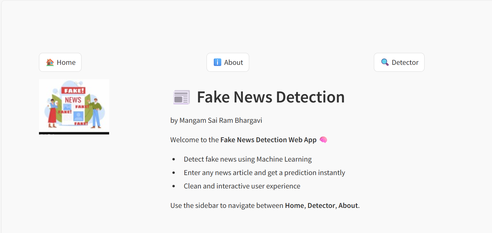
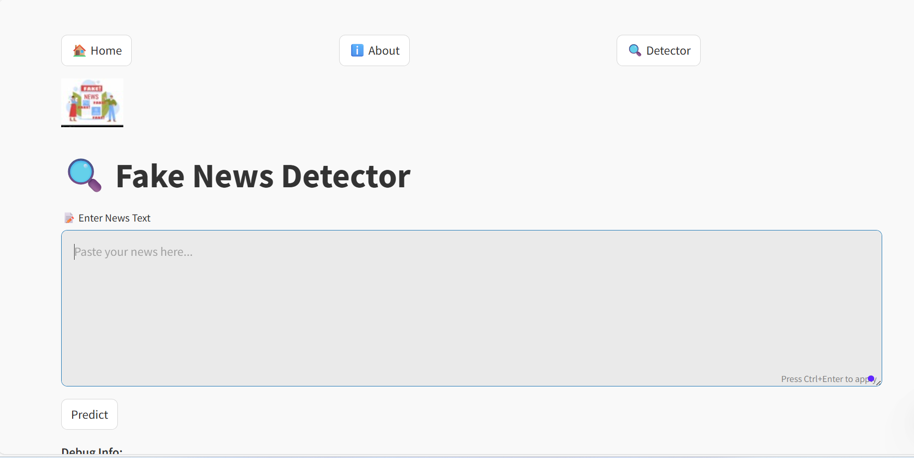
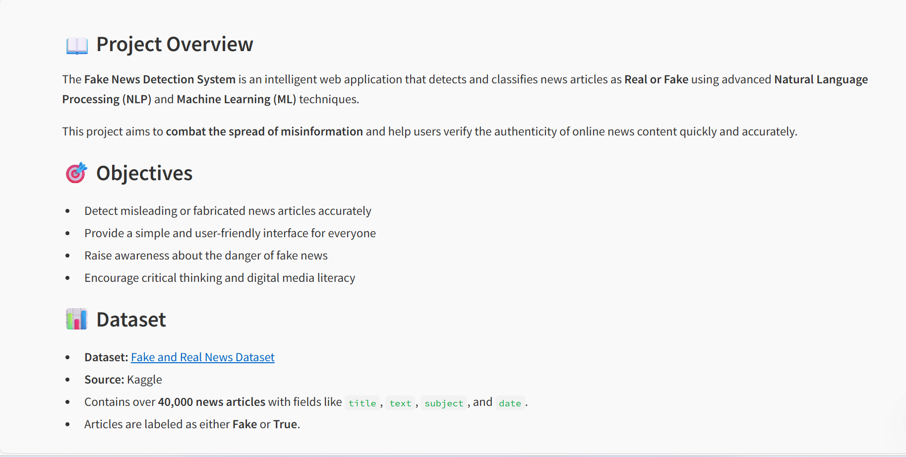

## 📌 Project Overview

The **Fake News Detection System** analyzes textual news data and predicts whether the content is **genuine or misleading**. It leverages advanced text preprocessing, feature extraction, and supervised machine learning models to ensure accurate classification.

This project aims to:
- Reduce the spread of misinformation  
- Improve digital media literacy  
- Provide a fast and easy-to-use news verification tool  

---

## 🎯 Objectives

- Detect misleading or fabricated news articles accurately  
- Provide a simple and user-friendly interface  
- Raise awareness about the dangers of fake news  
- Encourage critical thinking and responsible content consumption  

---

## 📊 Dataset

- **Dataset:** Fake and Real News Dataset  
- **Source:** Kaggle  
- **Size:** 40,000+ news articles  
- **Features:** title, text, subject, date  
- **Labels:** Fake, True  

---

## ⚙️ Key Features

- NLP-based text preprocessing and vectorization  
- Machine learning model for real-time prediction  
- Interactive and clean Streamlit web interface  
- Instant classification of pasted news text  
- Modular and well-structured codebase  

---

## 🛠️ Tech Stack

- **Programming Language:** Python  
- **Libraries:** Scikit-learn, Pandas, NumPy  
- **NLP Techniques:** TF-IDF, Text Cleaning  
- **Framework:** Streamlit  
- **Version Control:** Git & GitHub  

---

## 🚀 How to Run the Project

```bash
git clone https://github.com/bhargavi4470/Fake-News-Detection.git
cd Fake-News-Detection
pip install -r requirements.txt
streamlit run app.py
## 📌 Project Overview

The **Fake News Detection System** analyzes textual news data and predicts whether the content is **genuine or misleading**. It leverages advanced text preprocessing, feature extraction, and supervised machine learning models to ensure accurate classification.

This project aims to:
- Reduce the spread of misinformation  
- Improve digital media literacy  
- Provide a fast and easy-to-use news verification tool  

---

## 🎯 Objectives

- Detect misleading or fabricated news articles accurately  
- Provide a simple and user-friendly interface  
- Raise awareness about the dangers of fake news  
- Encourage critical thinking and responsible content consumption  

---

## 📊 Dataset

- **Dataset:** Fake and Real News Dataset  
- **Source:** Kaggle  
- **Size:** 40,000+ news articles  
- **Features:** title, text, subject, date  
- **Labels:** Fake, True  

---

## ⚙️ Key Features

- NLP-based text preprocessing and vectorization  
- Machine learning model for real-time prediction  
- Interactive and clean Streamlit web interface  
- Instant classification of pasted news text  
- Modular and well-structured codebase  

---

## 🛠️ Tech Stack

- **Programming Language:** Python  
- **Libraries:** Scikit-learn, Pandas, NumPy  
- **NLP Techniques:** TF-IDF, Text Cleaning  
- **Framework:** Streamlit  
- **Version Control:** Git & GitHub  

---

## 🚀 How to Run the Project

```bash
git clone https://github.com/bhargavi4470/Fake-News-Detection.git
cd Fake-News-Detection
pip install -r requirements.txt
streamlit run app.py

---

### 🏠 Home Page


### 🔍 Fake News Detector


### ℹ️ About Page

